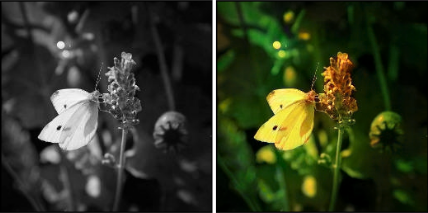
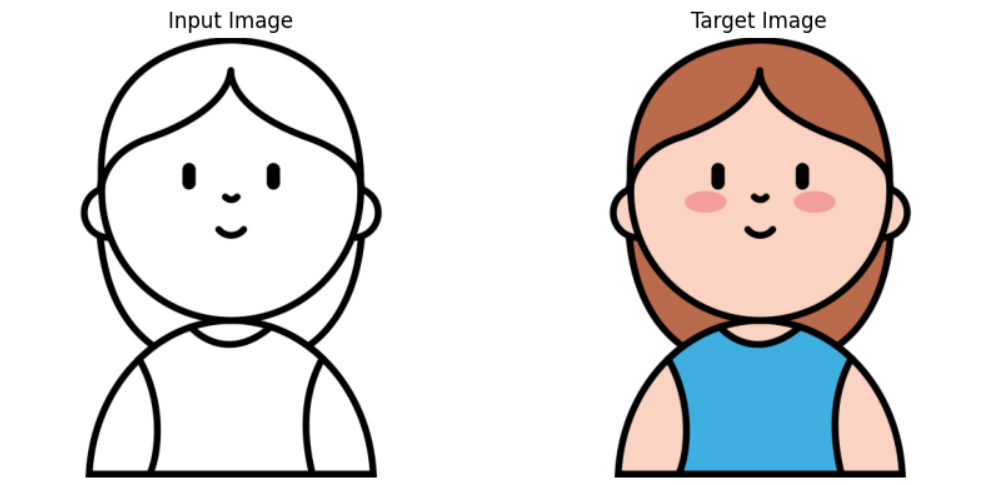
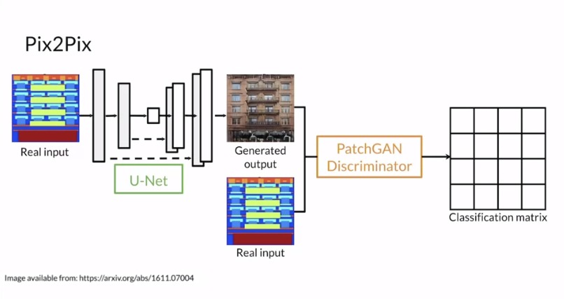

<div align="center">
    

<h1 align="center">Gan Colorization Project</h1>
</div>
    
## 1. Problem Statement
This project aims to develop a Generative Adversarial Network (GAN) that learns to generate colorized versions of animated character images. The dataset contains two types of images of these characters:
1. **Colored Images**: Fully colorized images showing the characters with all necessary details.
2. **Outline Images**: Simplified images showing only the boundaries or outlines of the characters, without any color information.

The goal is for the GAN to learn from these paired images, understanding the relationship between the outlines and the colored versions. Once trained, the model should be able to take a new outline image and generate a realistic, colorized version that maintains the style, details, and specific color schemes — particular colors for the shirt and hair — as seen in the training set.


<div align="center">
    
</div>

In this figure, we see the input outline image and the expected output image, where the character should have brown hair and a blue shirt.

## Installation

To set up this project, clone the repository and install the required dependencies:
```bash
git clone https://github.com/ARHPA/gan_colorization_project.git
cd GAN_Project
```


## 2. The Proposed Method

In this work, we propose a modified version of pix2pix for our task. Our reasons for choosing this approach are:

* Pix2pix closely aligns with our objectives. Although there are some differences between our work and pix2pix, it remains the closest model we’ve found.

* Pix2pix is widely popular and well-known for paired image-to-image translation. Many implementations and resources are available, making it easy to reference and build un.

* Additionally, pix2pix is straightforward, allowing us to apply our modifications easily and effectively.



This figure illustrates the architecture of our designed U-Net model.
